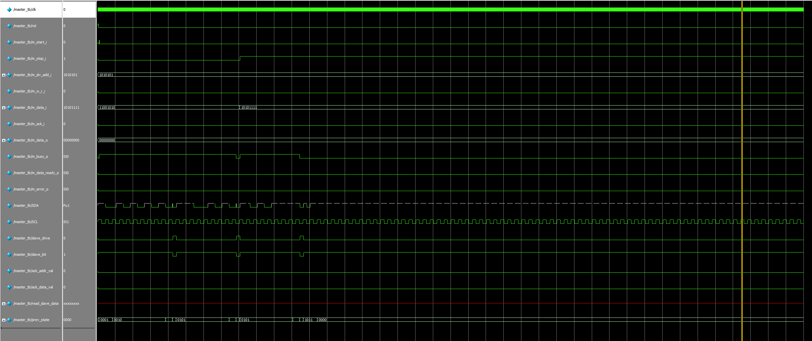
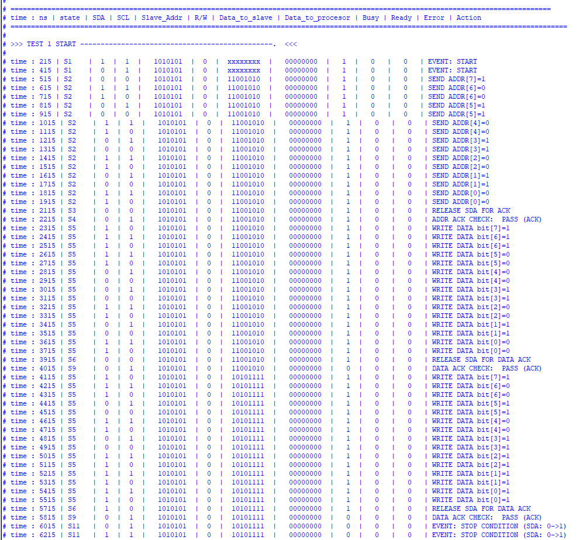
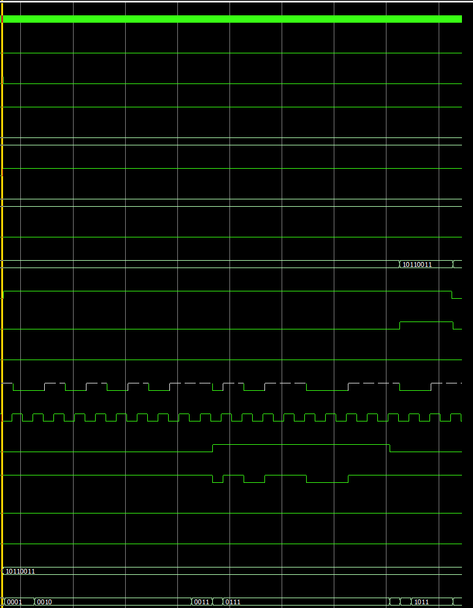
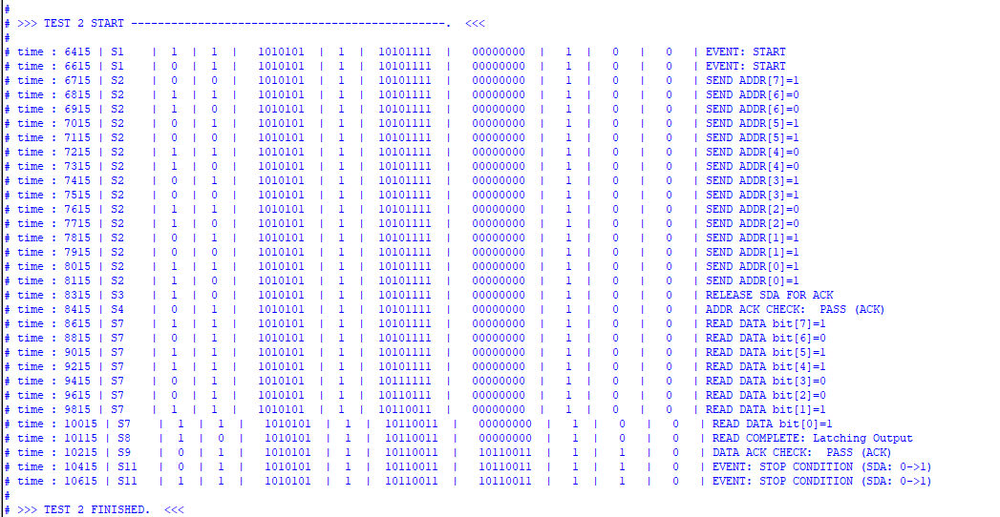
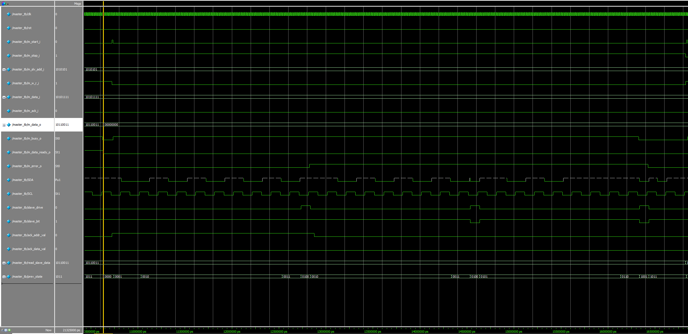
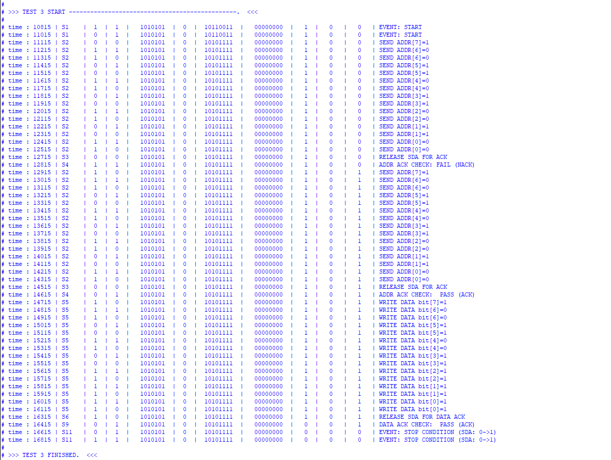
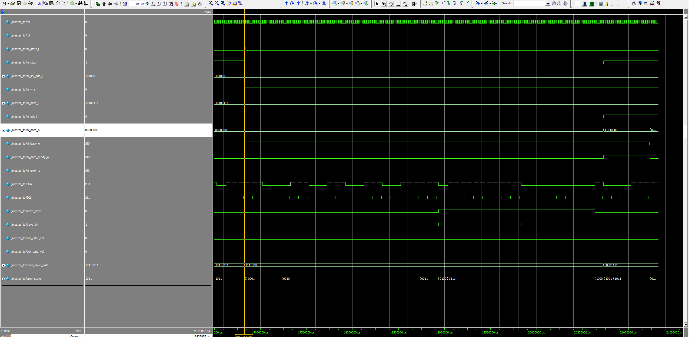
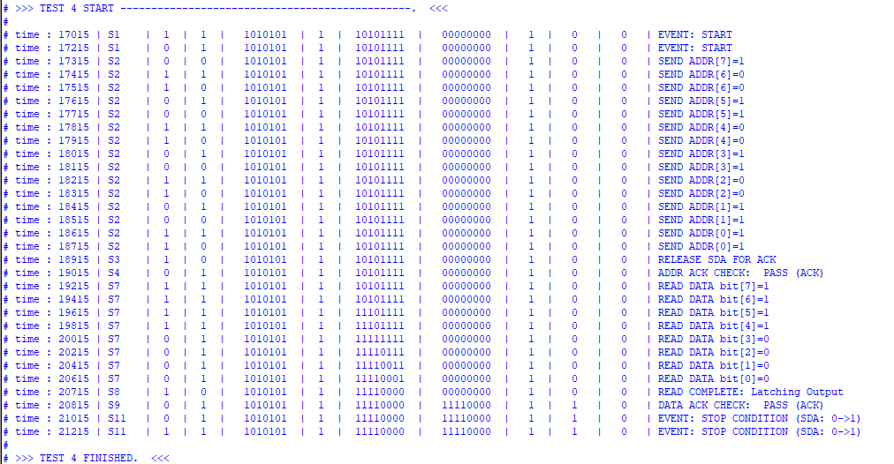
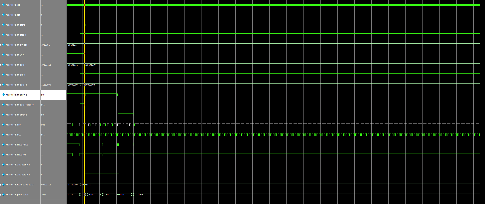
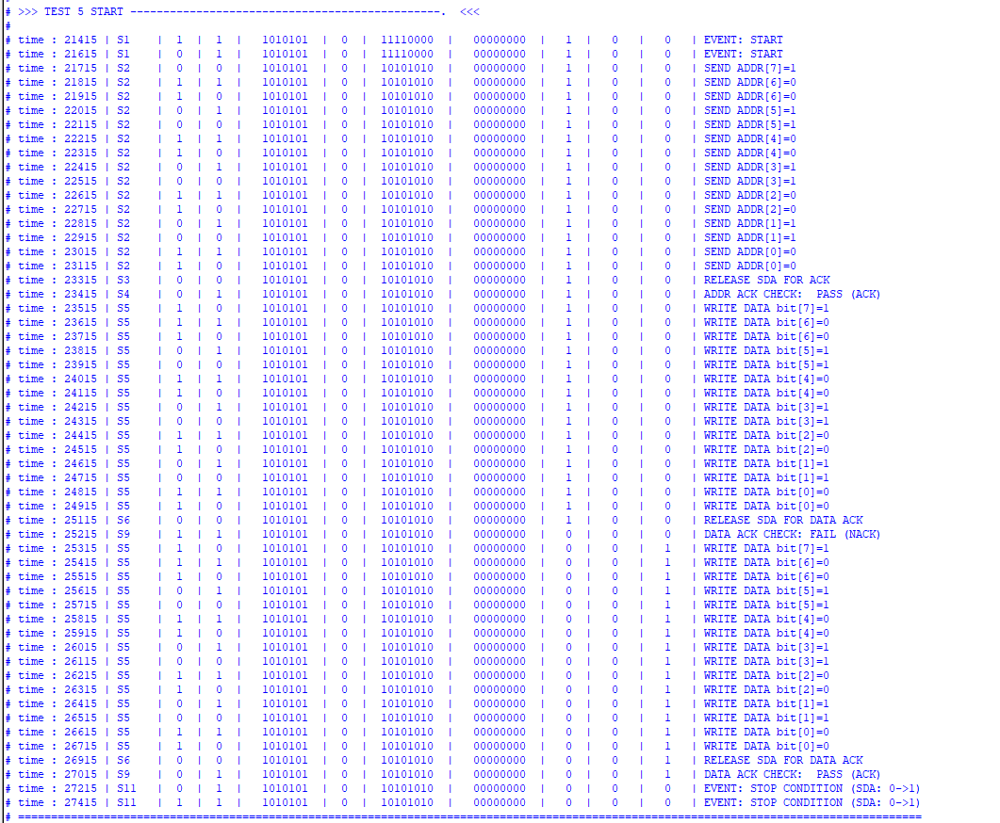

# I2C Master Controller

An implementation of an **I²C Master Controller** using **Verilog HDL**.

This project was developed as the **Final Project** for the **NTI Digital Design Training**. The design implements the **Master side** of the I²C protocol and was verified using a custom Verilog testbench with a simulated slave model.


---

# Features

- I²C Start Condition
- 7-bit Slave Address + R/W Bit
- Write Transaction
- Read Transaction
- Multi-byte Transfer
- ACK / NACK Detection
- Error Handling
- Busy Flag
- Data Ready Flag
- Stop Condition
- Configurable SCL Clock Divider
- FSM-Based Design

---

# Project Structure

```text
.
├── master.v
├── master_tb.v
├── master RTL view.pdf
├── slave.v
├── i2c_top.png
├── slave RTL view.pdf
├── i2c_top.v
├── i2c_top RTL view.pdf
├── i2c con output.txt
├── tb_result
│   ├── test1_W.png
│   ├── test1_con.png
│   ├── test2_W.png
│   ├── test2_con.png
│   ├── test3_W.png
│   ├── test3_con.png
│   ├── test4_W.png
│   ├── test4_con.png
│   ├── test5_W.png
│   └── test5_con.png
└── README.md
```

---

# Architecture

## I2C Top-Level RTL


---

## Master RTL

> Open **master RTL view.pdf** for the complete RTL schematic.

---

## Slave RTL

> Open **slave RTL view.pdf** for the complete RTL schematic.

---

# Design Overview

The controller is implemented as a **Finite State Machine (FSM)**.

Implemented states include:

- Idle
- Start Condition
- Address Transmission
- Address ACK
- Data Write
- Data Read
- Data ACK
- Multiple Byte Transfer
- Stop Condition

---

# Verification

A dedicated Verilog testbench was written to verify the controller.

Instead of implementing a complete I²C slave, a lightweight slave model was created inside the testbench to emulate:

- Address ACK
- Data ACK
- Read Data
- NACK Response

This approach allowed complete verification of the master without requiring a separate slave implementation.

---

# Test Cases


| Test Write Transaction 
| Test Read Transaction 
| Test Address NACK and Retry 
| Test Multi-byte Read 
| Test Error Handling 

---

# Test Results

## Test 1

### Waveform



### Console Output



---

## Test 2
### Waveform



### Console Output



---

## Test 3
### Waveform



### Console Output



---

## Test 4 
### Waveform



### Console Output



---

## Test 5
### Waveform



### Console Output



---

# Tools

- Verilog HDL
- Intel Quartus Prime Lite
- ModelSim
- GitHub

---

# Notes

- The project contains the I²C Master, I²C Slave, and a top-level module.
- Verification was completed for the Master controller using a custom testbench.
- The Slave and top-level modules were implemented, but dedicated testbenches for them have not been completed yet.
---

# Repository Contents

- RTL source code
- Testbench
- RTL schematics
- Simulation console log
- Waveform screenshots
- Verification results

---
---

## Author

**Ahmed Mohamed Attia Mohamed**

Faculty of Engineering, Zagazig University  
Electronics and Communications Engineering

Email: ahm3d.m.attia@gmail.com

# License

This project was developed for educational purposes as part of the **NTI Digital Design Training**.
